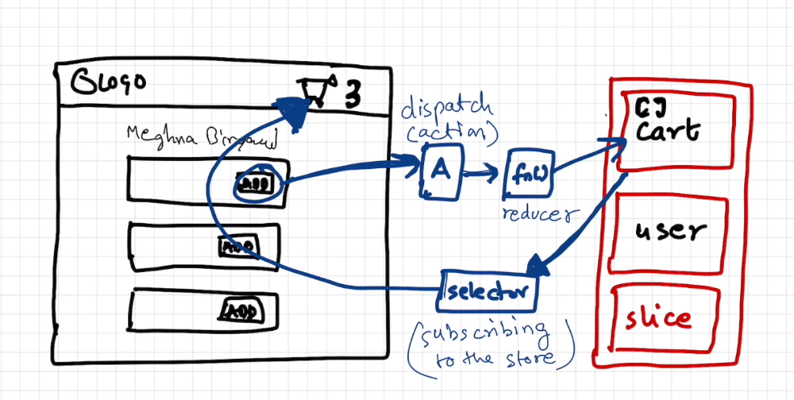
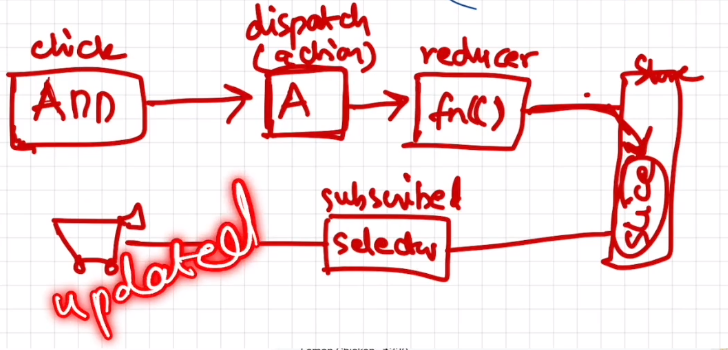

# namaste-react :rocket: 


## Project Overview

This is an project based learning where we will build a food ordering app having following components.

<details>

<summary>Mentioned here (Expand)</summary>

* Header
    - Logo
    - Nav items
* Body
    - Search bar and button
    - Card container (repeatable)
        - Img
        - Restaurant name, Star rating, cuisines, delivery time
* Footer
    - Copyright
    - Links
    - Address
    - Contact us

</details>

## 01 Inception

<details>
  <summary>Summary</summary>
  
### Concepts Learned (01 Inception)

1. How to use React cdn?
1. How to write js inside html itself?
1. How to write js inside a new file and inject it in html?
1. How to Create a element using React
1. How to render a component using RactDOM?
1. How does React.createElement and ReactDOM.createRoot works?
1. How to use CSS in react?
1. What is Element,Props,Child in React?
1. How to Create nested Child using React?
1. How to Add Sibling Components?

#### Answer of above ques with Example

#### HTML

```html
<body>
    <div id="root">
        <!-- It will be loaded for a very small fraction of time and then react will replace this root with its own content -->
        <h1>Dipankar</h1>
    </div>
    <!-- CDN links for react. using this link will inject react and react dom library into the browser -->
    <script crossorigin src="https://unpkg.com/react@18/umd/react.development.js"></script>
    <script crossorigin src="https://unpkg.com/react-dom@18/umd/react-dom.development.js"></script>
    <!-- Only writing above 2 tags would inject react into our project using CDN.
In the console you can write React and ReactDOM and you can see the properties. -->
    <!-- Include your react js lines inside a new js file -->
    <script src="./App.js"></script>
</body>
```

  react.development.js - base library for react.
  react-dom.development.js - for dom manipulation and interaction.
  Costliest operation in browsers is Dom manipulation.

  #### JS

  ```javascript
  //create an element-simillar to document.createElement
  /**
   * React.createElement(object) =>HTML (browser understands)
   * React.createElement creates and object
   * While it is rendering into DOM it converts the object into html
   * param 1 - type: element name
   * param 2 - props: attributes
   * param 3 - children inside props: text of the element
   */
  const h1 = React.createElement("h1",{xyz:'abc',id:'heading'},"hello World from React!");
  const h2 = React.createElement("h2",{xyz:'abc',id:'heading2'},"This is a h2 element");
  console.log(h1);
  // Create nested Child using React.

  //add multiple child inside the element using array (siblings)
  const child = React.createElement('div',{id:'child'},['child div',h1,h2]);
  const parent = React.createElement('div',{id:'parent'},child);

  //ReactDOM is for dom interaction, Make #root as the root element of react
  const root = ReactDOM.createRoot(document.getElementById("root"));
  //render the element inside root
  root.render(parent);```

  ```

  console.log(h1) will give the entire h1 object.
  React.createElement gives an object which is later converted into HTML (browser understandable).

  #### CSS

  ```css
  #heading{
      color:red;
  }
  ```

</details>

## 02 Igniting our App

<details>
<summary>Summary</summary>

### Concepts Learned (02 Igniting our App)

1. **Can React build a production ready app without using any package/library**
Ans- No, A lot of other Packages are required.
2. **What is NPM**
Ans- NPM is evrything but Node package Manager. It manages Packages and is a repository containing all the packages. It works as a package manager behind the scene but it's full form is not Node Package Manager.
3. **How can you make your project use NPM**
A- We can make our project use npm using `npm init`.
    <details>
    <summary>Example</summary>

    ```cmd
    PS C:\Users\dipan\Desktop\Javascript\React\namaste-react> npm init
    This utility will walk you through creating a package.json file.
    It only covers the most common items, and tries to guess sensible defaults.

    See `npm help init` for definitive documentation on these fields
    and exactly what they do.

    Use `npm install <pkg>` afterwards to install a package and
    save it as a dependency in the package.json file.

    Press ^C at any time to quit.
    package name: (namaste-react)
    version: (1.0.0)                                                                                                          
    description: This is the project done while learning namaste react course
    entry point: (App.js)                                                                                                     
    test command: jest                                                                                                        
    git repository: https://github.com/dipankarsahoo180/namaste-react.git
    keywords:
    author: Dipankar Sahoo                                                                                                    
    license: (ISC)                                                                                                            
    About to write to C:\Users\dipan\Desktop\Javascript\React\namaste-react\package.json:

    {
        "name": "namaste-react",
        "version": "1.0.0",
        "description": "This is the project done while learning namaste react course",
        "main": "App.js",
        "scripts": {
        "test": "jest"
        },
        "repository": {
        "type": "git",
        "url": "git+https://github.com/dipankarsahoo180/namaste-react.git"
        },
        "author": "Dipankar Sahoo",
        "license": "ISC",
        "bugs": {
        "url": "https://github.com/dipankarsahoo180/namaste-react/issues"
        },
        "homepage": "https://github.com/dipankarsahoo180/namaste-react#readme"
    }
    Is this OK? (yes)
    ```

    </details>

4. **How to add a package /dependencies into your project**
Ans- By using the command `npm install <package_name>`.
For ex: `npm install -D Parcel`. Then it will create a node dependencies/devDepenedencies inside your Package.json.
5. **What is a Bundler**
Ans-A bundler is the most important package in our project while doing development. There are multiple bundlers like parcel,vite,webpack etc. Our whole needs to be bundled,minified,cleaned,compressed, packages 7 a lot fo other stuffs before it can be sent prod. Bundler does all these jobs.
6. **What is Parcel**
Ans- parcel is a bundler. it is easy to configure.
    * `npm install -D parcel`.
It also does a lot of other functions like:
    * Creating a dev build
    * Building local Server
    * HMR Hot Module Replacement
    * Uses file watching algorithm (written in c++)
    * Caching for faster Builds
    * Image optimization
    * Minification
    * Bundling
    * Compress
    * Consistent Hashing
    * Code Splitting
    * Differential bundling to support older versions
    * Diagnostic
    * Error handling
    * HTTPS
    * Tree shaking - remove unused nodes
7. **What is -D in `npm install -D Parcel`**
Ans- That means we are installing parcel package/library as a dev dependency.There are two types of dependencies.
    * dependencies - required for project and is required in production.
    * devDependencies - required during development.
8. **What is the package.json file**
Ans- Package.json will be created right after npm init command and it keeps tracks of the dependencies installed.
9. **What is tilde(`) and carret(^)**
Ans- They represent auto upgradable to Major and Minor versions respectively.
10. **What is the package-lock.json file that got created automatically**
Ans- Package-lock.json has exact version of all the dependencies and their dependencies mentioned in detail. It keeps track of all the details of the dependencies and transitive dependencies used in the project.
11. **Do we Need to Put node_modules folder into git**
Ans- Don't put the files and folders that you can regenerate again into git. It is unnecessary.
12. **How to Ignite your app**
Ans- Since we have already installed parcel, we can ignite our app using the command `npx parcel index.html`.
    <details>
    <summary> Ignite your app</summary>
    
    ```cmd
    PS C:\Users\dipan\Desktop\Javascript\React\namaste-react> npm parcel index.html
    Unknown command: "parcel"

    To see a list of supported npm commands, run:
        npm help
    PS C:\Users\dipan\Desktop\Javascript\React\namaste-react> npx parcel index.html
    Server running at http://localhost:1234
    ✨ Built in 608ms
    ```

    </details>
13. **How to get react and react-dom using npm instad of cdn**
Ans- using CDN is not a good way and is a costliest operation as it makes a network call. we can install these dependensies as packages using `npm install <package_name>` command
Ex: `npm install react and npm install react-dom`
14. **Will it work if we remove the CDN?**
Ans- It will give error as `Uncaught ReferenceError: React is not defined`. So we have to import both react and react-dom
    *   ```js
        import React from "react";
        import ReactDOM from "react-dom/client";
        ```

15. **Will it work afer that?**
Ans- No It will give you error. `@parcel/transformer-js: Browser scripts cannot have imports or exports.`. Basically you have to Add the **type="module"** attribute to the `<script>` tag inside index.html. It is because by default it is treated as a normal javascript file and to use it as a module and import any other module to this Js file, we have to explicitly tell that this is a js file of module type. And then it would work.

</details>

## 03 Laying the foundation
<details>
<summary>Summary</summary>

### Concepts Learned (03 Laying the foundation)

1. **How to create a script to start project instead of writing `npx parcel index.html`**    
Ans-  Go to the package.json and inside `"scripts"`, add the node `"start":"parcel index.html"`. Then go to your terminal and write `npm run start` or `npm start`.  
Simillarly,  write `"build":"parcel build index.html"` to make a prod build. And to execute it write `npm run build` in terminal. `npm build` will not work here because is `run` is a reserved keyword by npm that works with `start`.

2. **What is a react element**  
It is an object but while rendering into DOM using react-dom library it will be rendered as an HTML. This is the syntax to create a react element.</br></br>  

    * ```javascript
        const h1 = React.createElement("h1",{xyz:'abc',id:'heading'},"hello World from React!");
        //ReactDOM is for dom interaction, Make #root as the root element of react
        const root = ReactDOM.createRoot(document.getElementById("root"));
        //render the element inside root
        root.render(h1);
        ```

3. **Is it a good way to use React.createElement**  
Ans- No, this is not a good way and make the code complex and is not suitable for creating production ready apps. So, we use **JSX** instead.
4. **What is JSX?**  
JSX is a HTML or XML like syntax used for creating react elements. Is is not a part of react,it is also not a pure Javascript. It is transpiled before it reaches javascript engine/converted into object equivalent of `react.createElement()` by **`babel`** library which is also a depenedency for `Parcel` so that browser can unserstand it.</br></br>  

    *   ```javascript
        const h1JSX = <h1 id='heading'>Hello World from React with JSX!</h1>
        //ReactDOM is for dom interaction, Make #root as the root element of react
        const root = ReactDOM.createRoot(document.getElementById("root"));
        //render the element inside root
        root.render(h1JSX);
        ```

    *   ```javascript
        const h1 = React.createElement("h1",{xyz:'abc',id:'heading1',key:'ist-h1',class="h1Class"},"Hello World from React!");
        const h1JSX = <h1 id='heading2' key='ist-h1Jsx' className="jsxClass">Hello World from React with JSX!</h1>
        //ReactDOM is for dom interaction, Make #root as the root element of react. 
        //Also notice the attributes are in camelCase but they will convert into normal attributes when they render as HTML.
        console.log(h1JSX); //It will log a same object what react.createElement gives
        const root = ReactDOM.createRoot(document.getElementById("root"));
        //render the element inside root
        root.render([h1,h1JSX]);
        ```

5. **Give some examples of JSX code**  

    *   ```Javascript
        const h1JSX = <h1 id='headingJSX' key='ist-h1Jsx'>Hello World from React with JSX!</h1>;
        const h1JSX1 = <h1 id='heading2' key='ist-h1Jsx' className="jsxClass">Hello World from React with JSX!</h1>;
        const h1JSX2 = (<h1 id='heading2' key='ist-h1Jsx' className="jsxClass">Hello World from React with JSX!</h1>);
        const h1JSX3 = (
        <div>
            <h1 id='heading2' key='ist-h1Jsx' className="jsxClass">Hello World from React with JSX!</h1>
            <h2 id='heading2' key='ist-h2Jsx' className="jsxClass">Hello World from React with JSX!</h2>
        </div>
        );
        const h1JSX4 = (
        <>
            <h1 id='heading2' key='ist-h1Jsx' className="jsxClass">Hello World from React with JSX!</h1>
            <h2 id='heading2' key='ist-h2Jsx' className="jsxClass">Hello World from React with JSX!</h2>
        </>);
        //ReactDOM is for dom interaction, Make #root as the root element of react
        const root = ReactDOM.createRoot(document.getElementById("root"));
        //render the element inside root
        root.render([h1,h1JSX,h1JSX1,h1JSX2,h1JSX3,h1JSX4]);
        ```

6. **What are some of the extensions which you can use to boost your productivity**  

    * Prettier
    * Bracket pair Colorization Toggler.
    * Eslint
    * Better Comments

7. **What is a React component**  
It is a function/class and retunred object of which can be rendered as a html in browser.
8. **What are the types of components in react**  
    * Class based component - old way of writing code
    * Functional component - Latest in tech - It's just a normal javascript function with **PascalCase**.  
        <details>
        <summary>Example of Functional component</summary>

        ```Javascript
        import React from "react";
        import ReactDOM from "react-dom/client";

        const Heading = ()=> {
            return (
                <>
                    <h1 id='heading2' key='ist-h1Jsx' className="jsxClass">Hello World from React with JSX1!!</h1>
                    <h2 id='heading2' key='ist-h2Jsx' className="jsxClass">Hello World from React with JSX2!!</h2>
                </>
                )
        };


        //ReactDOM is for dom interaction, Make #root as the root element of react
        const root = ReactDOM.createRoot(document.getElementById("root"));
        //render the element inside root
        root.render(<Heading/>); // Use the functional component as a tag to render
        ```

        </details>

9. **What is component composition**  
Composing one/more components into another component
    *   <details>
        <summary>Example of component composition</summary>

        ```javascript
        import React from "react";
        import ReactDOM from "react-dom/client";


        const Title = ()=> {
            return (
                <>
                    <h1 key='title' className="jsxClass">Title!!</h1>
                </>
                )
        };
        const Header = ()=> {
            return (
                <>
                    <Title></Title>
                    <h1 key='header' className="jsxClass">JSX Heading!!</h1>
                    
                </>
                )
        };


        //ReactDOM is for dom interaction, Make #root as the root element of react
        const root = ReactDOM.createRoot(document.getElementById("root"));
        //render the element inside root
        root.render(<Header/>);
        ```

        </details>

10. **How can you write javascript expression inside JSX**  
By wrapping the code inside `{}`
    <details>
    <summary>Example</summary>

    ```Javascript
    import React from "react";
    import ReactDOM from "react-dom/client";

    const Elem = () =>(
        <>
            <h1>React Element!!</h1>
        </>
    )
    const title =  (
            <>
                <h1 key='title' className="jsxClass">Title!!</h1>
            </>
            )
    const number = 1000;
    const Header = ()=> {
        return (
            <>
                {title} 
                {<Elem/>}
                {number}
                {console.log('Dipankar')}
                <h1 key='header' className="jsxClass">JSX Heading!!</h1>
            </>
            )
    };
    //ReactDOM is for dom interaction, Make #root as the root element of react
    const root = ReactDOM.createRoot(document.getElementById("root"));
    //render the element inside root
    root.render(<Header/>);
    ```

    </details>

</details>

## 04 Talk is cheap, show me the code

<details>
<summary>Summary</summary>

### Concepts Learned (04 Talk is cheap, show me the code)

1. **How can you write css in react?** 
    - By using attribute className instead of class.  
        <details>
        <summary>Example</summary>

        ```javascript
        const AppLayout = () =>{
            return (
                <div className="app">
                    <Header/>
                    <Body/>
                </div>
            )
        }
        ```

        ```css
        .app{
            display: flex;
            justify-content: space-between;
            border: 1px solid black;
        }
        ```
        
        </details> 

    - By using inline css.  
        <details>
        <summary>Example</summary>

        ```javascript
        const styleCard = {
            background: 'lightgrey',
            textAlign:'center'
        }

        const Restaurant = () => {
            return(
                <div className="res-card" style={styleCard}>
                    <h3>Meghna Foods</h3>
                </div>
            )
        }
        ```

        OR  

        ```javascript
        const styleCard = {
            background: 'lightgrey',
            textAlign:'center'
        }

        const Restaurant = () => {
            return(
                <div className="res-card" style={{ background: 'lightgrey', textAlign:'center' }}>
                    <h3>Meghna Foods</h3>
                </div>
            )
        }
        ```

        </details> 
        
2. **What is props in react?**  
Ans- By using props we can pass properties from parent comp/arguements to a function.  
    -   <details>
        <summary>Example(we are passing name,cuisine as props)</summary>
        
        ```javascript
        const Body = () => {
            return(
                <div className="body">
                    <div className="search">
                        Search            
                    </div>

                    <div className="res-container">
                        <Restaurant name="Jubilee Foods" cuisine="South Indian"/>
                        <Restaurant name="KFC" cuisine="American"/>
                        <Restaurant/>
                        <Restaurant/>
                    </div>
                </div>
            )
        }
        const styleCard = {
            background: 'lightgrey',
            textAlign:'center'
        }

        const Restaurant = ({name,cuisine}) => {
            return(
                <div className="res-card" style={styleCard}>
                    </img>
                    <h3>{name || 'Meghna Foods'}</h3>
                    <h4>{cuisine || 'North Indian'}</h4>
                    <h4>4.4</h4>
                    <h4>38 mins</h4>
                </div>
            )
        }
        ```
        </details>

3. **What is  config driven UI?**  
It means the UI is driven by a config. Which means based on configuration user will be shown/get personalized data
Ex: Swiggy API `https://www.swiggy.com/dapi/restaurants/list/v5?lat=20.3625249&lng=85.83262599999999&`

4. **How would you loop over an array and render multiple cards?**  
-   Ex:  
    ```javascript
    const Body = () => {
        return(
            <div className="body">
                <div className="search">
                    Search
                </div>

                <div className="res-container">
                {
                    card?.gridElements?.infoWithStyle?.restaurants?.map(el=>
                        <Restaurant key={el.info.id} resData={el}/>
                    )
                }
                </div>
            </div>
        )
    }
    ```
5. **Give an example how you can use fetch API**  
First Install this chrome extension from here `https://chrome.google.com/webstore/detail/cors-unblock/lfhmikememgdcahcdlaciloancbhjino`.  
and then run the following code to understand

    ```javascript
    const Body = () => {
        const [card,setCard] = useState([]);

        const  fetchData = async() => {
            try {
            const response = await fetch('https://www.swiggy.com/dapi/restaurants/list/v5?lat=20.3625249&lng=85.83262599999999');
            const data = await response.json();
            const card = data.data.cards.find(el => el.card.card.id === 'top_brands_for_you').card.card;
            setCard(card?.gridElements?.infoWithStyle?.restaurants);
            } catch (error) {
            console.error('Fetch error:', error);
            //throw error;
            }
        
        }

        useEffect(() => {
            fetchData();
        }, []);

        
        return(
            <div className="body">
                <div className="search">
                    Search
                </div>

                <div className="res-container">
                {
                    card?.map(el=>
                        <Restaurant key={el.info.id} resData={el}/>
                    )
                }
                </div>
            </div>
        )
    }
    ```
    
</details>

## 05 Lets get hooked

<details>
<summary>Summary</summary>

### Concepts Learned (05 Lets get hooked)

1. **What are the different types of import we use in Javascript?**  
Two types of Export/Import.  
    -   Default Export/Import
        ```javascript
        export default Component;  
        import Component from "path";
        ```

    -   Named Export/Import
        ```javascript
        export const Component;  
        import {Component} from "path";
        ```

1. **What are hooks in React?**  
Hooks are like normal js functions but provided by react.  
for ex: `useState()` and `useEffect()`

1. **What is useState() hook**  
useState is a React Hook that lets you add a state variable to your component.  

    ```javascript
    const [state, setState] = useState(initialState);
    ```
1. **What is reconciliation?**  
It is an alogorithm came in react 16 by react fiber, which uses an algorithm to selectively update some particular nodes/elements inside html instead of whole html by comapring the DOM nodes.  
Actual DOM: These are the real tags.  
Virtual DOM: representation of actual DOM. It is basically the object (reactElement). You can console log <Body/> and/or <Head/> and you can see an object is printed.
</details>

## 06 Exploring the World

<details>
<summary>Summary</summary>

### Concepts Learned (06 Exploring the World)

1. **What is monolithic and microservices architecture**  
A monolithic application is built as a single unified unit while a microservices architecture is a collection of smaller, independently deployable services. <a href="https://www.atlassian.com/microservices/microservices-architecture/microservices-vs-monolith">refer here</a>

2. **How `useEffect()` is called**  
First the component will be rendered as HTML and  
then it will call `useEffect()` and  
then it will run the code inside the callback of useEffect

3. **Can we write multiple `useEffect()` inside a single component**  
Yes.
    ```Javascript
    useEffect(() => {
        console.warn('use effect 1');
    }, []);
    useEffect(() => {
        fetchData();
        console.warn('use effect 2');
    }, []);
    useEffect(() => {
        console.warn('use effect 3');
    }, []);
    ```
4. **What is Shimmer**  
We load a fake screen instead of blank untill we get the data from server/api in realtime to improve UX. We acheive this using conditional rendering.

    ```javascript
    const Body = () => {

        const [listOfRestaurants, setListOfRestaurants] = useState([]);
        const [filteredRestaurants, setFilteredRestaurants] = useState([]);
        const fetchData = async () => {
            try {
                const response = await fetch(SWIGGY_URL);
                const data = await response.json();
                const card = data.data.cards.find(el => el.card.card.id === 'top_brands_for_you').card.card;
                setListOfRestaurants(card?.gridElements?.infoWithStyle?.restaurants);
                setFilteredCard(card?.gridElements?.infoWithStyle?.restaurants);
            } catch (error) {
                console.error('Fetch error:', error);
                //throw error;
            }

        }

        useEffect(() => {
            fetchData();
        }, []);
        //conditioinal rendering
        return (listOfRestaurants.length === 0) ?
        <Shimmer /> :

        (
            <div className="filter">
                <div className="search">
                    <input className='search-text' type="text" onChange={(e) => {
                        if(!e.target?.value) {
                            setFilteredRestaurants(listOfRestaurants);
                            return;
                        }else{
                            const filteredCard = listOfRestaurants.filter(el => (el.info.name.toUpperCase()).includes(e.target?.value?.toUpperCase()));
                            setFilteredRestaurants(filteredCard);
                        }
                    }}>

                    </input>
                </div>
                <button className='top-rated-btn' onClick={
                    () => {
                        const filteredCard = listOfRestaurants.filter(el => el.info.avgRating > 4);
                        setFilteredRestaurants(filteredCard);
                    }
                }> Filter Top Rated restaurants</button>

                <button className='reset-btn' onClick={
                    () => {
                        setFilteredRestaurants(listOfRestaurants);
                    }
                }> Reset </button>
            </div>
        )
    }
    ```
    
</details>


## 07 Finding the path
<details>
<summary>Summary</summary>

### Concepts Learned (07 Finding the path)

1. **How to use routing in react?**  
we can use react-router-dom package to create routes in react.  
    ```javascript
    import React from "react";
    import ReactDOM from "react-dom/client";
    import Header from "./components/Header";
    import { Body } from "./components/Body";
    import { createBrowserRouter,RouterProvider } from "react-router-dom";
    import About from "./components/About";


    const AppLayout = () =>{
        return (
            <div className="app">
                <Header/>
                <Body/>
            </div>
        )
    }


    const appRouter = createBrowserRouter(
        [
            {
                path:"/",
                element : <AppLayout/>,
            },
            {
                path:"/about",
                element : <About/>
            },
            
        ]
    );

    //ReactDOM is for dom interaction, Make #root as the root element of react
    const root = ReactDOM.createRoot(document.getElementById("root"));
    //use RouterProvider for Routing
    root.render(<RouterProvider router={appRouter} />);
    ```

2. **How to routing but keeping Header and Footer constant in react?**
We can use `</Outlet>` and `children` property inside router object as a combination to do that
    ```javascript
    import React from "react";
    import ReactDOM from "react-dom/client";
    import Header from "./components/Header";
    import { Body } from "./components/Body";
    import { createBrowserRouter, Outlet, RouterProvider } from "react-router-dom";
    import About from "./components/About";
    import ContactUs from "./components/ContactUs";
    import Cart from "./components/Cart";

    const AppLayout = () => {
        return (
            <div className="app">
                <Header />
                <Outlet />
            </div>
        )
    }


    const appRouter = createBrowserRouter(
        [
            {
                path: "/",
                element: <AppLayout />,
                children: [

                    {
                        path: "",
                        element: <Body />
                    }, 
                    {
                        path: "about",
                        element: <About />
                    }, 
                    {
                        path: "contact-us",
                        element: <ContactUs />
                    }, 
                    {
                        path: "cart",
                        element: <Cart />
                    }
                ]
            }

        ]
    );

    //ReactDOM is for dom interaction, Make #root as the root element of react
    const root = ReactDOM.createRoot(document.getElementById("root"));
    //render the element inside root
    root.render(<RouterProvider router={appRouter} />);
    ```

2. **How can you build links so that user can click on them and redirected to certain routes in react?**  
We can use `<Link to=''>Label</Link>` from react-router-dom to acheive this.  
    ```javascript

    import { useState } from "react";
    import logo from "../assets/logo.png"
    import { Link } from "react-router-dom";

    const Header = () => {
        const [jsxButton,setJsxButton] = useState('Login')
        return (
            <>
                <div className="header">
                    <Link to='/'>
                        <div className="logo">
                        </img>
                        </div>
                    </Link>
                    
                    <div className="nav-items">
                        <ul>
                            <li><Link to='/'>Home</Link></li>
                            <li><Link to='about'>About us</Link></li>
                            <li><Link to='contact-us'>Contact us</Link></li>
                            <li><Link to='cart'>Cart</Link></li>
                        </ul>
                    </div>
                </div>
            </>
        )
    }

    export default Header;
    ```

3. **How can you create your own error page in react?**  
By adding `errorElement: <componentName/>` property inside the router object.
    ```javascript
    const appRouter = createBrowserRouter(
        [
            {
                path: "/",
                element: <AppLayout />,
                errorElement: <Error/>,
                children: [
                    {
                        path: "",
                        element: <Body />
                    }, 
                    {
                        path: "about",
                        element: <About />
                    }, 
                    {
                        path: "contact-us",
                        element: <ContactUs />
                    }, 
                    {
                        path: "cart",
                        element: <Cart />
                    }
                ]
            }

        ]
    );
    ```

4. **How can you get error details and show them in error page in react?**  
By using `useRouteError` from `react-router-dom`.  


    ```javascript
    import Header from "./Header"
    import {useRouteError} from 'react-router-dom'; 

    const Error = () => {
        const error = useRouteError()
        return (
            <>
                <Header></Header>
                <h1>Opps!! {error.status} {error.statusText}</h1>
                <h1>{error?.error?.message}</h1>
            </>
        )
    }
    export default Error;
    ```

4. **How can use dynamic routing in react?**  
    * Step 1: Create an element and use useParams() to get the dynaic parameter from url. `const {resId} = useParams();` .
    * Step 2: pass the queryparam as   resId from Link tag
        ```javascript
        <Link to={'restaurant/'+el.info.id}>
            <RestaurantCard resData={el} />
        </Link>
        ```
    * Step 3: Configure the dyanmic routing in router object as well  
        ```javascript
        {
            path: "restaurant/:resId",
            element: <RestaurantMenu />
        }
    
        ```

</details>


## 08 Let's get Classy
<details>
<summary>Summary</summary>

### Concepts Learned (08 Let's get Classy)

1. **What are class based components?**  
This is an older way of writing code in react. Ex:  

    ```javascript
    import React from "react";

    export default class UserClass extends React.Component {
    
    render() {
        return (
            <>
                <h1>Name: Dipankar</h1>
                <h1>Location: Bangalore</h1>
                <h1>Contact: +9098909890</h1>
            </>
            );
        }
    }
    ```

1. **How to access props in class based component?**  
By using `constructor(props)`. Ex: 
 
    ```javascript
    import React from "react";

    export default class UserClass extends React.Component {
        constructor(props) {
            super(props); // We always have to write this
            //console.log(props);
            this.name = props.name;
            //OR
            //this.name = this.props.name
        }
        /** This will also work
        render() {
            return (
                <>
                    <h1>Name: {this.name}</h1>
                    <h1>Location: {this.props.location}</h1>
                    <h1>Contact: +9098909890</h1>
                </>
            );
        }
        */
        render() {
        const {name,location} = this.props;
            return (
                <>
                    <h1>Name: {name}</h1>
                    <h1>Location: {location}</h1>
                    <h1>Contact: +9098909890</h1>
                </>
            );
        }
    }
    ```

    And pass the props from parent like below:

    ```javascript
    import React from "react";
    import UserClass from "./UserClass";

    const About = () => {
        return (
            <>
                <h1>About</h1>
                <div className="about-card">
                    <div>
                        <UserClass name="Dipankar (Class Based)" location="Bangalore(Class)" />
                    </div>
                </div>
            </>
        );
    };

    export default About;
    ```

1. **How to create and update state variable in class?**  
States were created whenever a new instance of class is created in class based components in react.
Constructor is a best place to create state variables unsing `this.state`.  
We can not update the state variables directly like `this.state.count =12;Instead we use 
    ```javascript
    this.setstate({
        stateName:'stateValue'
    })
    ```
    Example:

    ```javascript
    import React from "react";

    export default class UserClass extends React.Component {
        constructor(props) {
            super(props);
            this.state = {
                count: 0,
                result: "Pass",
            };
        }

        render() {
            const updateCount = () => {
                this.setState({
                    count: ++this.state.count,
                    result: "Failed",
                });
            };
            const { name, location } = this.props;
            return (
                <>
                    <h1>Name: {name}</h1>
                    <h1>Location: {location}</h1>
                    <h1>Contact: +9098909890</h1>
                    <h1>Count: {this.state.count}</h1>
                    <h1>Result: {this.state.result}</h1>
                    <button className="global-btn" onClick={() => updateCount()}>
                        Update State Variable
                    </button>
                </>
            );
        }
    }
    ```

1. **Explain lifecycle of react class based components**  
    Constuctor() ==> Render() ==>(Parent followe by child) 
    Child component didMoount ==>Parent Component didMount;

    Parent constructor
    About.js:18 Parent render start
    About.js:33 inside parend render

    UserClass.js:10 Child constructor
    UserClass.js:24 Child render Start
    UserClass.js:35 Inside child render

    ChildClassA.js:6 ChildClassA constructor
    ChildClassA.js:13 ChildClassA render Start
    ChildClassA.js:17 Inside ChildClassA render

    ChildClassB.js:6 ChildClassB constructor
    ChildClassB.js:13 ChildClassB render Start
    ChildClassB.js:17 Inside ChildClassB render

    UserClass.js:13 Child component Did Mount

    ChildClassA.js:9 ChildClassA component Did Mount

    ChildClassB.js:9 ChildClassB component Did Mount

    About.js:13 Parent component Did Mount<br/><br/>

    Example Parent Component:
    ```javascript
    import React from "react";
    import User from "./User";
    import UserClass from "./UserClass";
    import ChildClassA from "./ChildClassA";
    import ChildClassB from "./ChildClassB";
    class About extends React.Component {
        constructor(props) {
            super(props);
            console.log("Parent constructor");
        }

        componentDidMount() {
            console.log("Parent component Did Mount");
        }

        render() {
            console.log("Parent render start");
            return (
                <>
                    <h1>About</h1>
                    <div className="about-card">
                        <div>
                            <UserClass
                                name="Dipankar (Class Based)"
                                location="Bangalore(Class)"
                            />
                        </div>
                    </div>
                    {console.log("inside parend render")}
                    <ChildClassA />
                    <ChildClassB />
                </>
            );
        }
    }

    export default About;
    ```
    Child Component Example:
    ```javascript
    import React from "react";

    export default class UserClass extends React.Component {
        constructor(props) {
            super(props);
            this.state = {
                count: 0,
                result: "Pass",
            };
            console.log('Child constructor');
        }
        componentDidMount(){
            console.log('Child component Did Mount')
        }

        render() {
            const updateCount = () => {
                this.setState({
                    count: ++this.state.count,
                    result: "Failed",
                });
            };
            const { name, location } = this.props;
            console.log('Child render Start');
            return (
                <>
                    <h1>Name: {name}</h1>
                    <h1>Location: {location}</h1>
                    <h1>Contact: +9098909890</h1>
                    <h1>Count: {this.state.count}</h1>
                    <h1>Result: {this.state.result}</h1>
                    <button className="global-btn" onClick={() => updateCount()}>
                        Update State Variable
                    </button>
                    {console.log('Inside child render')}
                </>
            );
        }
    }
    ```

1. **What is the use of `componentDidMount()` lifecycle hook**  
componentDidMount method runs after the component is rendered in the browser and then if we want to make any heavy processings we can do inside this method. For example: making an api call.

1. **What is the use of `componentDidUpdate()` lifecycle hook** 
This is a lifecycle hook called after each re-render of the component. It does not called for the first render.

1. **What is the use of `componentWillUnmount()` lifecycle hook** 
This is a lifecycle hook called Just before unmounting of the component. First parent component will unmount and then child component
Example:
Parent component:

    ```javascript
    import React from "react";
    import User from "./User";
    import UserClass from "./UserClass";
    import ChildClassA from "./ChildClassA";
    import ChildClassB from "./ChildClassB";
    class About extends React.Component {
        constructor(props) {
            super(props);
            console.log("Parent constructor");
        }

        componentDidMount() {
            console.log("Parent component Did Mount");
        }

        componentDidUpdate() {
            console.log("Parent component Did Update");
        }

        componentWillUnmount() {
            console.log("Parent component Will Unmount");
        }

        render() {
            console.log("Parent render start");
            return (
                <>
                    <h1>About</h1>
                    <div className="about-card">
                            <UserClass
                                name="Dipankar (Class Based)"
                                location="Bangalore(Class)"
                            />
                            <UserClass
                                name="Lizu (Class Based)"
                                location="Bhubaneswar(Class)"
                            />
                    </div>
                    {console.log("inside parend render")}
                    <ChildClassA />
                    <ChildClassB />
                </>
            );
        }
    }

    export default About;
    ```
    
    Child Component:

    ```javascript
    import React from "react";

    export default class UserClass extends React.Component {
        constructor(props) {
            super(props);
            this.state = {
                count: 0,
                result: "Pass",
            };
            console.log(this.props.name + " Child constructor");
        }

        async componentDidMount() {
            console.log(this.props.name + " Child component Did Mount");
            const jsonData = await fetch(
                "https://api.github.com/users/dipankarsahoo180"
            ).then((data) => data.json());
            console.warn(jsonData);
            this.setState({
                name: jsonData.name,
                location: jsonData.location,
                avatar_url: jsonData.avatar_url,
            });
            // Create an interval that increments the count state every 1000 milliseconds (1 second)
            this.interval = setInterval(() => {
                console.log('set interval called')
                this.setState((prevState) => ({
                    count: prevState.count + 1,
                }));
            }, 5000);
        }

        componentDidUpdate() {
            console.log(this.props.name + " Child component Did Update");
        }

        componentWillUnmount() {
            clearInterval(this.interval);
            console.log(this.props.name + " Child component Will Unmount");
        }

        render() {
            const updateCount = () => {
                this.setState({
                    count: ++this.state.count,
                    result: "Failed",
                });
            };
            const { name, location, avatar_url, count, result } = this.state;
            console.log(this.props.name + " Child render Start");
            return (
                <div className="user-card">
                    </img>
                    <p>Name: {name}</p>
                    <p>Location: {location}</p>
                    <p>count: {count}</p>
                    <p>result: {result}</p>
                    <button className="global-btn" onClick={() => updateCount()}>
                        Update State Variable
                    </button>
                    {console.log(this.props.name + " Inside child render")}
                </div>
            );
        }
    }
    ```

1. **Explain how you can clear interval inside function based react component (inside useEffects).**
We can make use of the callback method returned by `useEffects()`
Example:

    ```javascript
    import React from "react";
    import { useEffect } from "react";

    const ContactUs = () => {
        useEffect(() => {
            const interval = setInterval(() => {
                console.log("set interval called");
            }, 1000);

            return () => {
                clearInterval(interval);
            };
        });

        return <h1>ContactUs</h1>;
    };

    export default ContactUs;
    ```

</details>

## 09 Optimising our App
<details>
<summary>Summary</summary>


1. **Give an example of how you can create your own custom hook**  
According to the best practice we can just create a separate file with use as refix to its name and build our logic inside it.
    Example 1:

    ```javascript

    import { useEffect, useState } from "react";
    import { SWIGGY_REST_MENU } from "./Constants";

    const useRestrauntMenu =(resId) => {

        const[resInfo,setResInfo] = useState(null);

        useEffect(()=>{
            fetchData();
        },[])
        
        const fetchData = async ()=>{
            const response = await fetch(SWIGGY_REST_MENU + resId);
            const json = await response.json();
            console.log('custom Hook Json Data',json);
            setResInfo(json.data);
        }
        console.warn('custom Hook Reponse',resInfo)
        return resInfo;
    }

    export default useRestrauntMenu;
    ```
    Example 2:

    ```javascript
    import { useEffect, useState } from "react";

    const useOnlineStatus = () => {
        const [onlineStatus, setOnlineStatus] = useState(true);

        useEffect(() => {
            window.addEventListener("online", () => {
                setOnlineStatus(true);
            });
            window.addEventListener("offline", () => {
                setOnlineStatus(false);
            });
        }, []);

        return onlineStatus;
    };

    export default useOnlineStatus;

    ```

    And we can use it inside the component using following.

    ```javascript
    import { useParams } from "react-router-dom"
    import Shimmer from "./Shimmer";
    import RestaurantCard from "./RestaurantCard";
    import useRestrauntMenu from "../utils/useRestrauntMenu";
    import useOnlineStatus from "../utils/useOnlineStatus";

    export default function RestaurantMenu() {
        const { resId } = useParams();
        const restaurantDetails = useRestrauntMenu(resId); //Custom hook
        // Notice we are not storing the result into another variable by
        // using useState or useEffect hook because it is not required and
        // it will throw error if we do so.
        console.warn('resInfo',restaurantDetails);
        const isOnline = useOnlineStatus(); //Custom hook
        const itemList = 
        restaurantDetails?.cards? restaurantDetails?.cards[3]?.groupedCard? 
            restaurantDetails?.cards[3]?.groupedCard?.cardGroupMap?.REGULAR?.cards[1]?.card?.card?.itemCards ?
                restaurantDetails.cards[3]?.groupedCard?.cardGroupMap?.REGULAR.cards[1]?.card.card.itemCards :
                restaurantDetails.cards[3]?.groupedCard?.cardGroupMap?.REGULAR.cards[2]?.card.card.itemCards 
            :
            restaurantDetails?.cards[2]?.groupedCard?.cardGroupMap?.REGULAR?.cards[1]?.card?.card?.itemCards ?
                restaurantDetails.cards[2]?.groupedCard?.cardGroupMap?.REGULAR.cards[1]?.card.card.itemCards :
                restaurantDetails.cards[2]?.groupedCard?.cardGroupMap?.REGULAR.cards[2]?.card.card.itemCards 
        :null;
        console.log('card',itemList);

        if (!restaurantDetails || !itemList || !isOnline) return <Shimmer />;

        return (
            <>
                <div className="body">
                    <h1>{restaurantDetails.cards[0]?.card?.card?.info?.name}</h1>
                    <h2>Rating: {restaurantDetails.cards[0]?.card?.card?.info?.avgRatingString}</h2>
                    <h3>Total items: {itemList?.length}</h3>
                    <div className="res-container">
                        {
                            itemList.map((el, idx) => {
                                const resData = {
                                    info: {
                                        name: el.card.info.name,
                                        cloudinaryImageId: el.card.info.imageId,
                                        cuisines: [el.card.info.itemAttribute.vegClassifier, el.card.info.description],
                                        avgRating: el.card.info.ratings.aggregatedRating.rating,
                                        price: el.card.info.price,
                                        showLogInOutBtn:true
                                    }
                                }

                                return (
                                    <div key={el.card.info.id + '_' + idx + 0}>
                                        <RestaurantCard key={el.card.info.id + '_' + idx + 1} resData={resData} />
                                    </div>
                                )
                            })
                        }
                    </div>
                </div>
            </>
        )
    }
    ```

2. **What is Chunking/Code Splitting/Dynamic Bundling/Lazy Loading/Dynamic importing?**  
It is a way to break down the app into smaller logical chunks. We can acheive it using `lazy` and `Suspense`. 
Example: Here we are trying to lazy load `Grocery` and `About`.

    ```javascript
    import React, { lazy, Suspense } from "react";
    import ReactDOM from "react-dom/client";
    import Header from "./components/Header";
    import { Body } from "./components/Body";
    import { createBrowserRouter, Outlet, RouterProvider } from "react-router-dom";
    import About from "./components/About";
    import ContactUs from "./components/ContactUs";
    import Cart from "./components/Cart";
    import Error from './components/ErrorPage'
    import RestaurantMenu from "./components/RestaurantCardMenu";
    // import Grocery from "./components/Grocery";

    const Grocery = lazy(()=>import("./components/Grocery"));

    const AppLayout = () => {
        return (
            <div className="app">
                <Header />
                <Outlet />
            </div>
        )
    }


    const appRouter = createBrowserRouter(
        [
            {
                path: "/",
                element: <AppLayout />,
                errorElement: <Error />,
                children: [
                    {
                        path: "",
                        element: <Body />
                    },
                    {
                        path: "about",
                        element: (
                            <Suspense fallback={<Shimmer />}>
                                <About />
                            </Suspense>
                        ),
                    },
                    {
                        path: "contact-us",
                        element: <ContactUs />
                    },
                    {
                        path: "cart",
                        element: <Cart />
                    },
                    {
                        path: "grocery",
                        element: <Suspense fallback={<h1>Nothing here yet</h1>}><Grocery /></Suspense>
                        //element: <Suspense fallback={<Shimmer/>}><Grocery /></Suspense>
                    },
                    {
                        path: "restaurant/:resId",
                        element: <RestaurantMenu />
                    }
                ]
            }

        ]
    );

    //ReactDOM is for dom interaction, Make #root as the root element of react
    const root = ReactDOM.createRoot(document.getElementById("root"));
    //render the element inside root
    root.render(<RouterProvider router={appRouter} />);
    ```

</details>

## 10 Jo Dikhta hai, vo Bikta Hai

<details>
<summary>Summary</summary>

1. **Give an example of tailwind css class.**  
    ```javascript
    <div className="flex flex-wrap justify-around"> //tailwind classes
        {filteredRestaurants?.map((el) => (
            <Link
                className=""
                to={"restaurant/" + el.info.id}
                key={el.info.id}
            >
                <RestaurantCard resData={el} />
            </Link>
        ))}
    </div>
    ```
1. **Give an example of tailwind css class where you want to use your custom value**  
Here we have hardcoded the width to 250px
    ```javascript
    </img>
    ```
1. **Give an example of tailwind css class where you want to apply some pseudo classes**   
Example:
    ```javascript
    <div className="w-[250px] m-4 h-[420px] rounded-lg bg-slate-300 hover:bg-green-400">
        <p>Content goes here </p>
    </div>
    ```
</details>

## 11 Data is the new Oil

<details>
<summary>Summary</summary>


1. **What is higher order component in react?**
It is just a function which takes a component inside  and returns a component. 
For example: It takes an existing component, modifies/tweaks a bit and returns it.
    Example of Component `withPromtedLabel`:

    ```javascript
    import { SWIGGY_API_CARD_IMAGE } from "../utils/Constants";

    const RestaurantCard = (props) => {
        const {
            name,
            cloudinaryImageId,
            cuisines,
            avgRating,
            price,
            showLogInOutBtn,
        } = props.resData.info;
        return (
            <div className="w-[250px] m-4 h-[420px] rounded-lg bg-slate-300 hover:bg-green-400 relative">
                </img>
                <h3 className="text-center p-2 font-bold text-lg">{name.length >25? name.slice(0,25):name || ""}</h3>
                <div className="p-2">
                    <p>
                        {cuisines.join(", ").length <= 20
                            ? cuisines.join(", ")
                            : cuisines.join(", ").slice(0, 20) + "..."}
                    </p>
                    <p>Rating: {avgRating || ""}</p>
                    {price ? <p>Price: {price / 100}</p> : ""}
                    {showLogInOutBtn == true ? (
                        <div className="absolute bottom-2 left-[20%]">
                            <button className="mx-2 rounded-md px-4 py-1 bg-blue-500 text-white">
                                Add
                            </button>
                            <button className="mx-2 rounded-md px-1 py-1 bg-blue-500 text-white">
                                remove
                            </button>
                        </div>
                    ) : (
                        <></>
                    )}
                </div>
            </div>
        );
    };


    // Higher Order Component
    // input - RestaurantCard =>> RestaurantCardPromoted
    export const withPromtedLabel = (RestaurantCard) => {
        return (props) => {
        return (
            <div>
            <label className="absolute bg-black text-white m-2 p-2 rounded-lg z-10">
                Promoted
            </label>
            <RestaurantCard {...props} />
            </div>
        );
        };
    };
    export default RestaurantCard;

    ```
    Example of How to use it and pass props:

    ```javascript
    import RestaurantCard,{withPromtedLabel} from "./RestaurantCard";
    const Body = () => {
        const RestaurantCardPromoted = withPromtedLabel(RestaurantCard)
        return (
            <RestaurantCardPromoted resData={el}/>
        )
    }
    ```

    Complete Example of Component:

    ```javascript
    import React, { useState, useEffect } from "react";
    import RestaurantCard,{withPromtedLabel} from "./RestaurantCard";
    import { SWIGGY_URL } from "../utils/Constants";
    import Shimmer from "./Shimmer";
    import Search from "./Search";
    import { Link } from "react-router-dom";
    import useOnlineStatus from "../utils/useOnlineStatus";

    const Body = () => {
        const [listOfRestaurants, setListOfRestaurants] = useState([]);
        const [filteredRestaurants, setFilteredRestaurants] = useState([]);
        const [searchText, setSearchText] = useState("");
        const online = useOnlineStatus();
        const RestaurantCardPromoted = withPromtedLabel(RestaurantCard); //higher order function
        const fetchData = async () => {
            try {
                const response = await fetch(SWIGGY_URL);
                const data = await response.json();
                let card = data.data.cards.find(
                    (el) => el.card.card.id === "restaurant_grid_listing"
                ).card.card;
                card?.gridElements?.infoWithStyle?.restaurants?.forEach((el,idx)=>{
                    if(idx%3==0) el.promoted = true
                    else el.promoted =  false;
                });
                setListOfRestaurants(
                    card?.gridElements?.infoWithStyle?.restaurants
                );
                setFilteredRestaurants(
                    card?.gridElements?.infoWithStyle?.restaurants
                );
                console.warn(card?.gridElements?.infoWithStyle?.restaurants);
            } catch (error) {
                console.error("Fetch error:", error);
                //throw error;
            }
        };

        useEffect(() => {
            fetchData();
        }, []);
        if (!online)
            return (
                <>
                    <h1>Looks like you are offline!</h1>
                </>
            );
        return listOfRestaurants?.length === 0 ? (
            <Shimmer />
        ) : (
            <div className="">
                <Search
                    listOfRestaurants={listOfRestaurants}
                    setFilteredRestaurants={setFilteredRestaurants}
                    searchText={searchText}
                    setSearchText={setSearchText}
                />

                <div className="flex flex-wrap justify-around">
                    {filteredRestaurants?.map((el) => (
                        <Link
                            className=""
                            to={"restaurant/" + el.info.id}
                            key={el.info.id}
                        >
                            {
                                el.promoted ? <RestaurantCardPromoted resData={el}/> : <RestaurantCard resData={el} />
                            }
                            
                        </Link>
                    ))}
                </div>
            </div>
        );
    };

    export { Body };

    ```

1. **What is Controlled and uncontrolled components?**
If the element is controlled from parent then it is controlled components. But if the element manages all its states on its own it is uncontrolled element.

1. **What is lifting the state?**
Sometimes, you want the state of two components to always change together. To do it, remove state from both of them, move it to their closest common parent, and then pass it down to them via props. This is known as lifting state up, and it’s one of the most common things you will do writing React code

1. **What is Props drilling?**
Passing the props to more than 1 level deep is props drilling, And it is a problem because although the innermost component needs the data, reset of the inner components might not need that data but we have to pass them in order to pass it to inner most component. We use `Context` to avoid props drilling.

1. **What is `Context` in react and how to use it?**
Context provides a way to pass data through the component tree without having to pass props down manually at every level.
    Step 1: Create a Context

    ```javascript
    import { createContext } from "react";

    const UserContext = createContext({ loggedinUser: "Default User" });

    export default UserContext;
    ```

    Step 2: Access the Context Information

    ```javascript
    import React, { useContext } from "react";
    import UserContext from "../utils/UserContext";

    const ContactUs = () => {
        const data = useContext(UserContext);

        return (
            <>
                <h1>
                    Hello! {data.loggedInUser} You can email us at
                    dipankarsahoo180@gmail.com
                </h1>
            </>
        );
    };

    export default ContactUs;
    ```

    If you are using class based component, you can access it using `UserContext.Consumer`.

    ```javascript
    render() {
        console.log("Parent render start");
        return (
            <>
                <div>
                    <UserContext.Consumer>
                        {(data) => {
                            return (<>
                                <h1>Hello! , </h1>
                                <h1>{data.loggedInUser}</h1>
                            </>)
                        }}
                    </UserContext.Consumer>
                </div>
                <div className="flex flex-wrap justify-evenly">
                    <UserClass
                        name="Dipankar (Class Based)"
                        location="Bangalore(Class)"
                    />
                    <UserClass
                        name="Lizu (Class Based)"
                        location="Bhubaneswar(Class)"
                    />
                </div>
            </>
        );
    }
    ```

    Step 3 (optional): To Add/ Update/ set the value of userContext we use `<UserContext.Provider value={whatever_you_want_to_update}>`

    ```javascript
    const AppLayout = () => {
        const [userName, setUserName] = useState();

        //authentication
        useEffect(() => {
            // Make an API call and send username and password
            const data = {
                name: "Dipankar Sahoo",
            };
            setUserName(data.name);
        }, []);

        return (
            // Wrap the entire component inside UserContext(You can also wrap specific components too)
            //Providing the additional value,existing value here too
            //Now this is the provider of values instead of Context for all the elments its wrapping inside it
            <UserContext.Provider value={{ loggedInUser: userName, setUserName:setUserName }}>
                <div className="app">
                    <Header />
                    <Outlet />
                </div>
            </UserContext.Provider>
        );
    };
    ```

    And if we want to update the username in other child components, we can just access the function and call it like below.

    ```javascript
    import React, { useContext } from "react";
    import UserContext from "../utils/UserContext";

    const ContactUs = () => {
        const data = useContext(UserContext);
        return (
            <>
                <h1>
                Hello! <span className="font-bold">{data.loggedInUser}</span>{" "}
                You can email us at dipankarsahoo180@gmail.com
                </h1>
                <div className="m-2 p-1 flex items-center">
                    <label>UserName : </label>
                    <input
                        className="border border-black"
                        value={data.loggedInUser}
                        onChange={(e) => data.setUserName(e.target.value)}
                    />
                </div>
                <button
                    className="m-2 p-1 bg-blue-600 font-bold text-white rounded-lg"
                    onClick={() => data.setUserName("Lizu Sahoo")}
                >
                    Update User Name
                </button>
            </>
        );
    };

    export default ContactUs;
    ```

    We can also use nested Context too.

    ```javascript
    return (
        //Providing the value here
        <UserContext.Provider
            value={{ loggedInUser: userName, setUserName: setUserName }}
        >
            <div className="app">
                <UserContext.Provider
                    value={{ loggedInUser: 'Elon Musk', setUserName: setUserName }}
                >
                    <Header />
                </UserContext.Provider>
                <Outlet />
            </div>
        </UserContext.Provider>
    );
    ```

</details>


## 12 - Let's build our Store

<details>
<summary>Summary</summary>


1. [**What is redux?**](https://redux.js.org/)  
Redux is a state management tool used to store states across components. It is acheived using the combination of `react-redux` and `redux-toolkit`.  
    - redux-toolkit ia a newer way of writing redux.
    - react-redux is used to bridge the gap.
        
        

1. **What is a redux store?**  
Assume Redux store is a big whole object and it is kept at a central global place. Any compoent can access(r/w data) this store. And the store contains multiple `slice`.

1. **Write down the steps to implement redux toolkit.**
    - Install @reduxjs/toolkit and react-redux
        
        ```shell
        npm i @reduxjs/toolkit
        npm i react-redux
        ```

    - Build our store
        Step 1: Build a store
        
        ```javascript
        import { configureStore } from "@reduxjs/toolkit";

        const AppStore = configureStore

        export default AppStore;
        ```

    - Connect our store to our app
        Step 2: To use it in you app.js import `provider`

        ```javascript
        import { Provider } from "react-redux";
        ```

        Step 3: To use the store use simillar to Context config inside your root comp (App.js)

        ```javascript
        import { Provider } from "react-redux";
        import appStore from "./utils/appStore";

        const AppLayout = () => {
            return (
                <Provider store={appStore}>
                    <div className="app">
                        <Header />
                        <Outlet />
                    </div>
                </Provider>
            );
        };
        ```
    - Create a Slice(s) (cartSlice)
        Step 4: Create a `slice`  cartSlice with name, state and reducers which will contains actions in it.
        ```javascript
        import { createSlice } from "@reduxjs/toolkit";

        const cartSlice = createSlice(
            {
                name:'cart',
                initialState:{
                    items:[]
                },
                reducers:{
                    //mutating the state here
                    addItem:(state,action)=>{
                        state.items.push(action.payload)
                    },
                    removeItem: (state,action)=>{
                        state.items.pop(action.payload)
                    },
                    clearCart:(state,action)=>{
                        state.items.length = 0;
                    }
                }
            }
        )

        export const {addItem,removeItem,clearCart} = cartSlice.actions;

        export default cartSlice.reducer;
        ```
        
        Step 5: Now add the slice into your store into the reducer.
            
        ```javascript
        import { configureStore } from "@reduxjs/toolkit";
        import cartReducer from "./cartSlice";

        const appStore = configureStore({
            reducer: {
                cart: cartReducer,
                people: peopleSlice
            }
        })

        export default appStore;
        ```

    - Dispatch Reducer(action)
        Step 7: To update any value you can call the reducer action and dispatch it using `useDispatch` hook.

        ```javascript
        import { useDispatch } from "react-redux"; //import dispatcher
        import { addItem } from "../utils/cartSlice"; //import the action from the slice

        const dispatch = useDispatch();
        const handleAddItem=(item)=>{
            //dispatch an action with item as payload
            dispatch(addItem(item))
        }

        //call it from any button
        <button
            className="p-2 mx-16 rounded-lg bg-white text-green-600 font-bold shadow-lg"
            onClick={()=>handleAddItem(item)}
        >
            ADD +
        </button>
        ```

    - Selector (Used to read the data)
        Step 6: Read the data into the cart inside `Header.js`. And for this you can subsscribeusing `useSelector` hook.

        ```javascript
        import { useSelector } from "react-redux";
        
        //Subscribing to the store using a selector(appStore)
        //cart is the name of one of the reducer in the appStore
        const cartItems = useSelector((store)=>store?.cart?.items)
        
        //And access cartItems in JSX like below
        <li><Link className="p-2 text-lg font-bold" to='cart'>Cart({cartItems.length})</Link></li>
        ```

        Combined Example of Selector,dispatcher and actions
        ```javascript
        import React from "react";
        import { SWIGGY_API_CARD_IMAGE } from "../utils/Constants";
        import { useDispatch } from "react-redux";
        import { removeItem } from "../utils/cartSlice";
        import { useSelector } from "react-redux";

        const Cart = () => {
            //Subscribing to the store using a selector(appStore)
            //cart is the name of one of the reducer in the appStore
            const cartItems = useSelector((store) => store?.cart?.items);

            //publishing the value to the store
            const dispatch = useDispatch();
            const handleRemoveItem = (item) => {
                //dispatch an action with item as payload
                dispatch(removeItem(item));
            };

            return (
                <div className="flex flex-wrap justify-between bg-slate-300">
                    {cartItems.map((item) => (
                        <div
                            key={item.card.info.id}
                            className="p-2 mt-2 border-gray-200 border-b-2 text-left flex items-start w-full"
                        >
                            <div className="w-9/12">
                                <div className="py-2">
                                    <span>{item.card.info.name}</span>
                                    <span>
                                        - ₹
                                        {item.card.info.price
                                            ? item.card.info.price / 100
                                            : item.card.info.defaultPrice / 100}
                                    </span>
                                </div>
                                <p className="text-xs">{item.card.info.description}</p>
                            </div>
                            <div className="w-3/12 p-4 items-end relative">
                                <div className="absolute bottom-1 z-1">
                                    <button
                                        className="p-2 mx-16 rounded-lg bg-white text-green-600 font-bold shadow-lg"
                                        onClick={() => handleRemoveItem(item)}
                                    >
                                        REMOVE +
                                    </button>
                                </div>
                                
                            </div>
                        </div>
                    ))}
                </div>
            );
        };

        export default Cart;

        ```

</details>

## 13 Time for the Test

<details>
<summary>Summary</summary>

### Types of testing (devloper)
- Unit Testing
- Integration Testing
- End to End Testing - e2e testing

### Setting up Testing in our app
1. [Install React Testing Library](https://testing-library.com/docs/react-testing-library/intro)
1. [Installed jest](https://jestjs.io/docs/getting-started)
1. [Install Babel dependencies](https://jestjs.io/docs/getting-started#using-babel) `npm install --save-dev babel-jest @babel/core @babel/preset-env`
1. [Configure Babel](https://jestjs.io/docs/getting-started#using-babel) `babel.config.js`
1. [Configure Parcel](https://parceljs.org/languages/javascript/#usage-with-other-tools) `.parcelrc` Config file to disable default babel transpilation (Parcel uses babel behind the scene. when we use babel.config.js, this will overwrite the existing behaviour/settings/configs)
1. Create Jest config using `npx jest --init`
1. [Install jsdom library](https://testing-library.com/docs/react-testing-library/setup) `npm install --save-dev jest-environment-jsdom`

    ```shell
    PS C:\Users\dipan\Desktop\Javascript\React\namaste-react> npm i -D @testing-library/react

    added 56 packages, and audited 348 packages in 2m

    138 packages are looking for funding
    run `npm fund` for details

    found 0 vulnerabilities
    PS C:\Users\dipan\Desktop\Javascript\React\namaste-react> npm install --save-dev babel-jest @babel/core @babel/preset-env

    added 194 packages, changed 5 packages, and audited 542 packages in 2m

    143 packages are looking for funding
    run `npm fund` for details

    found 0 vulnerabilities
    PS C:\Users\dipan\Desktop\Javascript\React\namaste-react> npm i -D jest

    added 130 packages, and audited 672 packages in 3m

    158 packages are looking for funding
    run `npm fund` for details

    found 0 vulnerabilities
    PS C:\Users\dipan\Desktop\Javascript\React\namaste-react>
    PS C:\Users\dipan\Desktop\Javascript\React\namaste-react> npm run test

    > namaste-react@1.0.0 test
    > jest

    No tests found, exiting with code 1
    Run with `--passWithNoTests` to exit with code 0
    In C:\Users\dipan\Desktop\Javascript\React\namaste-react
    33 files checked.
    testMatch: **/__tests__/**/*.[jt]s?(x), **/?(*.)+(spec|test).[tj]s?(x) - 0 matches
    testPathIgnorePatterns: \\node_modules\\ - 33 matches
    testRegex:  - 0 matches
    Pattern:  - 0 matches
    PS C:\Users\dipan\Desktop\Javascript\React\namaste-react> npx jest --init

    The following questions will help Jest to create a suitable configuration for your project

    √ Would you like to use Typescript for the configuration file? ... no
    √ Choose the test environment that will be used for testing » jsdom (browser-like)
    √ Do you want Jest to add coverage reports? ... yes
    √ Which provider should be used to instrument code for coverage? » babel
    √ Automatically clear mock calls, instances, contexts and results before every test? ... yes

    📝  Configuration file created at C:\Users\dipan\Desktop\Javascript\React\namaste-react\jest.config.js
    PS C:\Users\dipan\Desktop\Javascript\React\namaste-react> npm install --save-dev jest-environment-jsdom

    added 51 packages, and audited 723 packages in 20s

    159 packages are looking for funding
    run `npm fund` for details

    found 0 vulnerabilities
    PS C:\Users\dipan\Desktop\Javascript\React\namaste-react> 
    ```
    But still if you run it will not run tests

    ```shell
    PS C:\Users\dipan\Desktop\Javascript\React\namaste-react> npm run test

    > namaste-react@1.0.0 test
    > jest

    No tests found, exiting with code 1
    Run with `--passWithNoTests` to exit with code 0
    In C:\Users\dipan\Desktop\Javascript\React\namaste-react
    35 files checked.
    testMatch: **/__tests__/**/*.[jt]s?(x), **/?(*.)+(spec|test).[tj]s?(x) - 0 matches
    testPathIgnorePatterns: \\node_modules\\ - 35 matches
    testRegex:  - 0 matches
    Pattern:  - 0 matches
    ```
    Simple example to test the sum of two numbers function
    
    ```javascript
    import { sum } from "../sum";

    test('sum of 2 numbers', () => { 
        const result = sum(3,4);
        //Assertion
        expect(result).toBe(7);
    })
    ```
    Now if you run `npm run test` it will give something like below

    ```shell
    PS C:\Users\dipan\Desktop\Javascript\React\namaste-react> npm run test

    > namaste-react@1.0.0 test
    > jest

    PASS  src/components/__tests__/sum.test.js                                                                                                                       
    √ sum of 2 numbers (3 ms)
                                                                                                                                                                    
    ----------|---------|----------|---------|---------|-------------------                                                                                           
    File      | % Stmts | % Branch | % Funcs | % Lines | Uncovered Line #s                                                                                            
    ----------|---------|----------|---------|---------|-------------------
    All files |     100 |      100 |     100 |     100 | 
    sum.js    |     100 |      100 |     100 |     100 | 
    ----------|---------|----------|---------|---------|-------------------
    Test Suites: 1 passed, 1 total
    Tests:       1 passed, 1 total
    Snapshots:   0 total
    Time:        1.34 s, estimated 2 s
    Ran all test suites.
    PS C:\Users\dipan\Desktop\Javascript\React\namaste-react>
    ```
1. Install `npm i -D @babel/preset-react` - to make JSX work in test cases
1. Include `['@babel/preset-react', {runtime: "automatic"}]` inside babel config 
1. To resolve toBeInTheDocument() is not a function `npm i -D @testing-library/jest-dom`. Now the following piece of code will also work
    ```jsx
    import { render,screen } from "@testing-library/react";
    import ContactUs from "../ContactUs";
    import "@testing-library/jest-dom" //toBeInTheDocument

    test('should render contact us component', () => { 
        
        render(<ContactUs></ContactUs>);

        //find all the headings in contact
        const heading = screen.getByRole('heading')

        expect(heading).toBeInTheDocument();
    })
    ```
1. To group your test cases use `describe()` function.
1. You can also write `it` in place of `test`.Both are same.
1. Coverage folder will be generated automatically stores all the coverage and report of the test cases. We don't need to put it in git.
1. To get the mock data for fetch api and use async method, we use `global` and `act` together to acheive the functionality
    ```javascript
    import { fireEvent, render, screen } from "@testing-library/react";
    import { Body } from "../Body";
    import MOCK_DATA from "../mocks/swiggyRestApiMock.json";
    import { act } from "react-dom/test-utils";
    import { BrowserRouter } from "react-router-dom";
    import "@testing-library/jest-dom";

    //To mock the fetch data, since fetch is present in browser but not in js dom
    global.fetch = jest.fn(() => {
        return Promise.resolve({
            json: () => {
                return Promise.resolve(MOCK_DATA);
            },
        });
    });

    //We should also enclose it inside act using the following syntax
    test('should Search Restaurant List and filter restaurant based on Top Rated and Reset the Restaurant List', async () => {
        await act(async () => render(
            <BrowserRouter>
                <Body />
            </BrowserRouter>
        ))

        const cardsBeforeSearch = screen.getAllByTestId("resCard");
        expect(cardsBeforeSearch.length).toBe(9);

        const searchInput = screen.getByTestId("searchInput");
        fireEvent.change(searchInput, { target: { value: "burger" } });

        const cardsAfterSearch1 = screen.getAllByTestId("resCard");
        expect(cardsAfterSearch1.length).toBe(1);

        fireEvent.change(searchInput, { target: { value: "" } });

        const cardsAfterSearch2 = screen.getAllByTestId("resCard");
        expect(cardsAfterSearch2.length).toBe(9);

        const topRatedButton = screen.getByText("Top Rated");
        fireEvent.click(topRatedButton);
        const cardsAfterSearch3 = screen.getAllByTestId("resCard");
        expect(cardsAfterSearch3.length).toBe(6);

        const resetButton = screen.getByText("Reset");
        fireEvent.click(resetButton);
        const cardsAfterSearch4 = screen.getAllByTestId("resCard");
        expect(cardsAfterSearch4.length).toBe(9);
    })
    ```
1. **What is `BeforeAll`, `BeforeEach`, `AfterAll` and `AfterEach`**?  
As their name suggests they run before/after each/all test methods.
Example:
    ```javascript
    import { render, screen, fireEvent } from "@testing-library/react";
    import ContactUs from "../ContactUs";
    import "@testing-library/jest-dom"
    import React from "react";
    import UserContext from "../../utils/UserContext";

    beforeAll(() => {
        console.log("Before All");
    });

    beforeEach(() => {
        console.log("Before Each");
    });

    afterAll(() => {
        console.log("After All");
    });

    afterEach(() => {
        console.log("After Each");
    });

    describe("Test all the functions and inputs", () => {
        test("renders the component with the user name and email", () => {
            // Arrange
            const mockUser = "Dipankar Sahoo";
            const mockSetUser = jest.fn();
            render(
                <UserContext.Provider value={{ loggedInUser: mockUser, setUserName: mockSetUser }}>
                    <ContactUs />
                </UserContext.Provider>
            );

            // Assert
            expect(screen.getByText(/Hello!/i)).toBeInTheDocument();
            expect(screen.getByText(mockUser)).toBeInTheDocument();
            expect(screen.getByText(/dipankarsahoo180@gmail.com/i)).toBeInTheDocument();
        });

        test("updates the user name when the input value changes", () => {
            // Arrange
            const mockUser = "Dipankar Sahoo";
            const mockSetUser = jest.fn();
            render(
                <UserContext.Provider value={{ loggedInUser: mockUser, setUserName: mockSetUser }}>
                    <ContactUs />
                </UserContext.Provider>
            );

            // Act
            const input = screen.getByDisplayValue(mockUser);
            fireEvent.change(input, { target: { value: "Lizu Sahoo" } });

            // Assert
            expect(mockSetUser).toHaveBeenCalledWith("Lizu Sahoo");
        });

        test("updates the user name when the button is clicked", () => {
            // Arrange
            const mockUser = "Dipankar Sahoo";
            const mockSetUser = jest.fn();
            render(
                <UserContext.Provider value={{ loggedInUser: mockUser, setUserName: mockSetUser }}>
                    <ContactUs />
                </UserContext.Provider>
            );

            // Act
            const button = screen.getByText(/Update User Name/i);
            fireEvent.click(button);

            // Assert
            expect(mockSetUser).toHaveBeenCalledWith("Lizu Sahoo");
        });
    })

    test('should render contact us component', () => {

        render(<ContactUs />);

        //find all the headings in contact
        const heading = screen.getByRole('heading')

        expect(heading).toBeInTheDocument();
    });

    test('should render button contact us component', () => {

        render(<ContactUs />);

        //find all the button in contact
        const button = screen.getAllByRole('button')

        expect(button.length).toBe(2)
    })

    it('should render button contact us component', () => {

        render(<ContactUs />);

        //find all the button in contact
        const button = screen.getByText('Update User Name')

        expect(button).toBeInTheDocument();
    })
    ```
    output:
    ```shell
    PS C:\Users\dipan\Desktop\Javascript\React\namaste-react> npm run test

    > namaste-react@1.0.0 test
    > jest

    PASS  src/components/__tests__/sum.test.js
    PASS  src/components/__tests__/RestaurantCard.test.js
    PASS  src/components/__tests__/ContactUs.test.js
    ● Console

        console.log
        Before All

        at Object.log (src/components/__tests__/ContactUs.test.js:8:13)

        console.log
        Before Each

        at Object.log (src/components/__tests__/ContactUs.test.js:12:13)

        console.log
        After Each

        at Object.log (src/components/__tests__/ContactUs.test.js:20:13)

        console.log
        Before Each

        at Object.log (src/components/__tests__/ContactUs.test.js:12:13)

        console.log
        After Each

        at Object.log (src/components/__tests__/ContactUs.test.js:20:13)

        console.log
        Before Each

        at Object.log (src/components/__tests__/ContactUs.test.js:12:13)

        console.log
        After Each

        at Object.log (src/components/__tests__/ContactUs.test.js:20:13)

        console.log
        Before Each

        at Object.log (src/components/__tests__/ContactUs.test.js:12:13)

        console.log
        After Each

        at Object.log (src/components/__tests__/ContactUs.test.js:20:13)

        console.log
        Before Each

        at Object.log (src/components/__tests__/ContactUs.test.js:12:13)

        console.log
        After Each

        at Object.log (src/components/__tests__/ContactUs.test.js:20:13)

        console.log
        Before Each

        at Object.log (src/components/__tests__/ContactUs.test.js:12:13)

        console.log
        After Each

        at Object.log (src/components/__tests__/ContactUs.test.js:20:13)

        console.log
        After All

        at Object.log (src/components/__tests__/ContactUs.test.js:16:13)

    PASS  src/components/__tests__/Search.test.js
    PASS  src/components/__tests__/Header.test.js                                                                         
    ---------------------|---------|----------|---------|---------|-------------------
    File                 | % Stmts | % Branch | % Funcs | % Lines | Uncovered Line #s 
    ---------------------|---------|----------|---------|---------|-------------------
    All files            |   85.05 |    79.16 |   74.28 |   85.71 |                   
    components           |   96.72 |    79.16 |     100 |   96.61 |                   
    Body.js              |      92 |     87.5 |     100 |   91.66 | 33,42             
    ContactUs.js         |     100 |      100 |     100 |     100 |                   
    Header.js            |     100 |      100 |     100 |     100 |                   
    RestaurantCard.js    |     100 |    66.66 |     100 |     100 | 20,28-30          
    Search.js            |     100 |      100 |     100 |     100 | 
    Shimmer.js           |     100 |      100 |     100 |     100 | 
    sum.js               |     100 |      100 |     100 |     100 | 
    components/mocks     |       0 |        0 |       0 |       0 | 
    logoMock.js          |       0 |        0 |       0 |       0 | 
    utils                |   57.69 |      100 |   18.18 |      60 | 
    Constants.js         |     100 |      100 |     100 |     100 | 
    UserContext.js       |     100 |      100 |     100 |     100 | 
    appStore.js          |     100 |      100 |     100 |     100 | 
    cartSlice.js         |      25 |      100 |       0 |   28.57 | 12-20
    peopleSlice.js       |      40 |      100 |       0 |      40 | 12-18
    useOnlineStatus.js   |      75 |      100 |      50 |      75 | 8,11
    ---------------------|---------|----------|---------|---------|-------------------

    Test Suites: 5 passed, 5 total
    Tests:       14 passed, 14 total
    Snapshots:   0 total
    Time:        3.923 s, estimated 4 s
    Ran all test suites.
    ```

</details>
